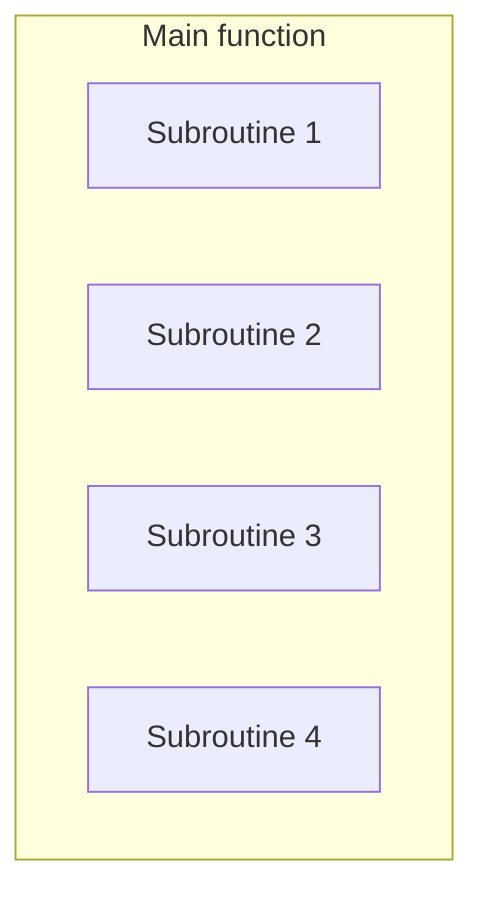
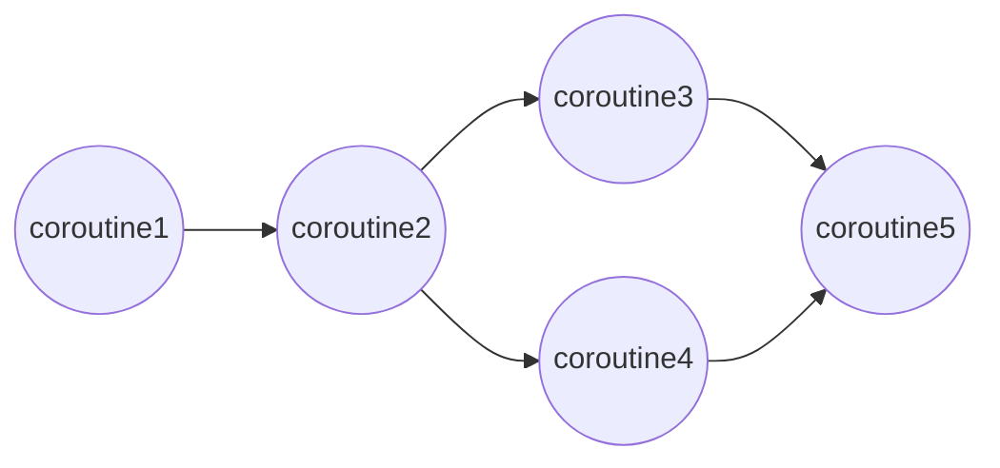

**async** keyword in Python is used to define asynchronous functions,which allow tasks to run without blocking the execution of other code.
* It is usually used for handling tasks like network requests,database operations or file I\O, where waiting for one task to finish would normally slow down the entire program.
* Async relies on await ,it needs await to actually pause and resume tasks.\
```py
import asyncio
 
async def func():
    print("Hello!")
    await asyncio.sleep(2)  # Pause for 2 second without blocking
    print("Geeks for Geeks")  #
 
asyncio.run(func())
 
```
output
```
Hello!
Geeks for Geeks
```
* **async def** : defines an async function
* **await** : pauses execution until the awaited function completes.
 
## 1. Running Multiple Tasks Simultaneosly
With the help of **async**, multiple tasks can run without waiting for  one to finish before starting another.
```py
import asyncio

async def task1():
    print("Task 1 started")
    await asyncio.sleep(3)
    print("Task 1 finished")

async def task2():
    print("Task 2 started")
    await asyncio.sleep(1)
    print("Task 2 finished")

async def main():
    await asyncio.gather(task1(), task2())  # Runs both tasks together

asyncio.run(main())

```
output
```
Task 1 started 
Task 2 started 
Task 2 finished 
Task 1 finished
```
* in this code task1 and task2 runs at the same time bcz of they are defined as async functions.
* task2() completes first because it waits only 1 second, while task1 waits for 3 sec

## 2. Using Asyn with Http Requests
It is a very common practice to use async keyword with HTTP requests.If we are using synchronous approach each blocks the execution until it completes.
* with async with send multiple requests simultaneously.
```py
import aiohttp
import asyncio

async def func():
    async with aiohttp.ClientSession() as session:
        async with session.get("https://example.com/") as res:
            data = await res.text()
            print(data[:100])  # Prints first 100 characters

asyncio.run(func())

```
output
```
<!doctype html>
<html>
<head>
    <title>Example Domain</title>
    <meta charset="utf-8" />
    <m

```
* to installation of aiohttp : **pip install aiohttp**
* **aiohttp** library is used to making async HTTP requests.
* **aiohttp.ClientSesssion()** , creates HTTP session and making an asynchrnous get request using **session.get()**.
* **await** keyword ensures that request completes before proceeding to next step.
* **Session**
  * session is used when making multiple requests
  * **Why?**
    * keeps cookies
    * Reuse connections(faster)
## 3.Using Async with File I\O
Python by default handles files one at a time,making the program wait until the task is done.
async can also be used for async operations.
* async.sleep() to represent delays where I\O operations takes time.

```py
import asyncio
import aiofiles
import asyncio

async def write():
    async with aiofiles.open(r"paste_your_file_path_here\file.txt", "w") as f:
        await f.write("Hello from Geeks for Geeks!")

async def read():
    async with aiofiles.open(r"paste_your_file_path_here\file.txt", "r") as f:
        print(await f.read())

asyncio.run(write())
asyncio.run(read())

```
output
```
Hello from Geeks for Geeks!
```
* write() writes data to file.txt if it already exist in the specified path,if it doesn't exist it automatucally creates a new file.
* read() opens the files and read the contents asynchronously.if file doesn't exist it will raise  a **FileNotFoundError**
* Here the writing is doing first,making sure that the file is created and written.Then, reads runs to reading and priniting the content.

## 4.Synchrnous and Asynchronous programming
Synchronous and Asynchrnous programming offers distinction to handling tasks and managing resources within software applications.
* In synchronous programming tasks are executed sequentailly,each operation waiting for the previous one to complete before proceeding.This ensures simplicity and predictabilty in code execution but it is ineffecient when dealing with time consuming operations.
* Asynchrnous programming allows tasks to run concurrently.By using callbacks,promises,asyn\aewait syntax,asynchrnous programming enhances responsiveness and scalability, particularly in scenaios invloving I\O operations or network calls.
* **callback function** : A callback function that is passed to another function and executed later.
```py
def process_data(callback):
    result = "Data received"
    callback(result)

def show_result(data):
    print(data)

process_data(show_result)

```
output

```
Data received
```
here show_result is the callbck function which is calles by process_data when the work is done.
* **callback in async**
```py
import asyncio

def task_done(task):
    print("Result:", task.result())

async def work():
    await asyncio.sleep(2)
    return "Finished"

async def main():
    task = asyncio.create_task(work())
    task.add_done_callback(task_done)

    await task

asyncio.run(main())

```
output after 2 seconds, 

```
Result: Finished
```
The callback runs automatically when the task completes.

* `JavaScript Promise
        ≈
Python Future/Task`
A Future represents a result that will be available later.

## 5.Coroutine in Python
**function** which is also known as a subroutine,procedure,sub-process.
* When the logic of a complex function is divided into several self-contained steps that are themselves functions,then these functions are called helper function or **subroutines**.
* Subroutines in Python are called by the **main function** which is responsible for coordinating the use of these subroutines.
* Subroutines have a single entry point.
* Coroutines are generalizations of subroutines.

* Difference between subroutines and coroutines
  * Unlike subroutines, coroutines have many entry points for suspending and resuming execution.Coroutine can suspend its execution and transfer control to other coroutine and can resume again execution from the point it left off.
*
  * Unlike subroutines, there is no main function to call corotines in a particular order and coordinate the results.Coroutines are cooperative , that means they link together to form a pipeline.One coroutine may consume input data and send it to other that process it.Finally there may be a coroutine to display the result.

 
### a- Coroutine VS Thread
* Coroutine and Thread seems to be same job.
* Incase of threads,its an OS that switches between threads according to the scheduler.
* While incase of coroutine it is programmer or program language which decides when to switch coroutines.
* corutines work cooperatively multitask by suspending and resuming at set points by programmer.
 
### b- Python Coroutine
In Python coroutines are similar to generators but with few extra methods and slight changes in how we use yield satements.
* Generators produce data for iteration while **coroutines can also consume data**.
* In Python 2.5 , now yield can also used as an expression.
* `(yield)` both pauses execution and later receives the value supplied by send(), when execution resumes and
* `name = (yield)` receives the value sent by `send()`.
```py
# Python3 program for demonstrating
# coroutine execution
 
def print_name(prefix):
    print("Searching prefix:{}".format(prefix))
    while True:
        name = (yield)
        if prefix in name:
            print(name)
 
# calling coroutine, nothing will happen
corou = print_name("Dear")
 
# This will start execution of coroutine and
# Prints first line "Searching prefix..."
# and advance execution to the first yield expression
corou.__next__()
 
# sending inputs
corou.send("Atul")
corou.send("Dear Atul")
 
```
output
```
Searching prefix:Dear
Dear Atul
```
Steps
1- corou = print_name("Dear")
Nothing executes yet. corou is just a generator object.
2- corou.__next__()
Execution begins:(start the coroutine)
3- name = (yield)
execution pauses at:
The coroutine is now waiting for a value.
4-corou.send("Atul")
The string "Atul" becomes the result of the (yield) expression:
name = "Atul"
 
**Why next is required first**
A coroutine must reach its first yield before it can receive a value. If you do:
`
corou = print_name("Dear")
corou.send("Dear Atul")
`
you get:
`TypeError: can't send non-None value to a just-started generator`
 
because the coroutine has not yet paused at a yield where it can accept the value.
So the sequence is:
```
corou = print_name("Dear")  # create
next(corou)                 # prime/start
corou.send("Atul")          # send value
corou.send("Dear Atul")     # send another value
```
note : corou.__next__() is same as next(corou)
 
* **Difference between generator object and coroutine**
    * when a generator object uses for .send() and (yield) as expression , then we can consider the generator object as coroutine.
|Usage  |Meaning|
|`yield value`| generator-style|
|`x = (yield)` + `.send()`| coroutine-style|
 
#### closing a coroutine
* Coroutine might run indefinitely, to close coroutine **close()** method is used.
* When a coroutine is closed it generates **GeneratorExit** exception.
* After closing coroutine, if we try to send values, it will raise the **StopIteration** exception.
```py
# Python3 program for demonstrating
# closing a coroutine
 
def print_name(prefix):
    print("Searching prefix:{}".format(prefix))
    try :
        while True:
                name = (yield)
                if prefix in name:
                    print(name)
    except GeneratorExit:
            print("Closing coroutine!!")
 
corou = print_name("Dear")
corou.__next__()
corou.send("Atul")
corou.send("Dear Atul")
corou.close()
 
```
output
```
Searching prefix:Dear
Dear Atul
Closing coroutine!!
```
#### Chaining coroutines for creating pipeline
* Coroutines can be set to pipes
* We can chain together coroutines and push data through the pipe using send().
* A Pipe needs  
  * **Initial source(producer)**- derives the whole pipeline.The producer is usually not a coroutine, it’s just a simple method.
  * A **sink**, which is the endpoint of the pipe. A sink might collect all data and display it.
 

 
```py
 
# Python3 program for demonstrating
# coroutine chaining
 
def producer(sentence, next_coroutine):
    '''
    Producer which just split strings and
    feed it to pattern_filter coroutine
    '''
    tokens = sentence.split(" ")
    for token in tokens:
        next_coroutine.send(token)
    next_coroutine.close()
 
def pattern_filter(pattern="ing", next_coroutine=None):
    '''
    Search for pattern in received token
    and if pattern got matched, send it to
    print_token() coroutine for printing
    '''
    print("Searching for {}".format(pattern))
    try:
        while True:
            token = (yield)
            if pattern in token:
                next_coroutine.send(token)
    except GeneratorExit:
        print("Done with filtering!!")
        next_coroutine.close()
 
def print_token():
    '''
    Act as a sink, simply print the
    received tokens
    '''
    print("I'm sink, i'll print tokens")
    try:
        while True:
            token = (yield)
            print(token)
    except GeneratorExit:
        print("Done with printing!")
 
pt = print_token()
pt.__next__()
pf = pattern_filter(next_coroutine = pt)
pf.__next__()
 
sentence = "Bob is running behind a fast moving car"
producer(sentence, pf)
 
```
output
```
I'm sink, i'll print tokens
Searching for ing
running
moving
Done with filtering!!
Done with printing!
 
```

## 6.Asyncio programming
Asyncio is a Python library that is used for concurrent programming.
* It is not multi-threading or multi-processing.
* Asyncio is used as a foundation for multiple Python asynchronous frameworks that provides high-performance network and web servers,database connection libraries etc.
```py
import asyncio

async def fn():
    print('This is ')
    await asyncio.sleep(1)
    print('asynchronous programming')
    await asyncio.sleep(1)
    print('and not multi-threading')

asyncio.run(fn())

```
* Note that we will make it sleep or wait with the help of `await asyncio.sleep(1)` keyword , not with `time.sleep()`.
* To run the program we have to use the run()
### Async Event Loop in Python

* The other function will begin to run anytime if there is a free time for  `astncio.create_task(fn2())`.
```py
import asyncio
async def fn():
    task=asyncio.create_task(fn2())
    print("one")
    #await asyncio.sleep(1)
    #await fn2()
    print('four')
    await asyncio.sleep(1)
    print('five')
    await asyncio.sleep(1)

async def fn2():
    #await asyncio.sleep(1)
    print("two")
    await asyncio.sleep(1)
    print("three")
    
asyncio.run(fn())
```
output
```
one
four
two
five
three
```
### I\O bound tasks using asyncio.sleep()
In this example, the func1(), func2(), and func3() functions are simulated I/O-bound tasks using asyncio.sleep().
* The order of completion might vary depending on how the asyncio eventloop schedules tasks.
```py
import asyncio


async def func1():
    print("Function 1 started..")
    await asyncio.sleep(2)
    print("Function 1 Ended")


async def func2():
    print("Function 2 started..")
    await asyncio.sleep(3)
    print("Function 2 Ended")


async def func3():
    print("Function 3 started..")
    await asyncio.sleep(1)
    print("Function 3 Ended")


async def main():
    L = await asyncio.gather(
        func1(),
        func2(),
        func3(),
    )
    print("Main Ended..")


asyncio.run(main())
```
output
```
Function 1 started..
Function 2 started..
Function 3 started..
Function 3 Ended
Function 1 Ended
Function 2 Ended
Main Ended..
```
### Difference Between Asynchronous and Multi-Threading Programming
* Asynchronous programming allows only one part of the program will run at a specific time.This ensures that one task is performed at a time,and other tasks proceed indpendently.
* In contrast , in multi-threading or multi-processing, here all three functions run concurrently without waiting for each other to finish.   

## 7.`await` in Python
* `await` is used to pause the execution of a task until the result of another task or operation is ready.
* This allows non-blocking ,concurrent execution of I\O bound tasks.
```py
import asyncio

async def fun():
    print("Hello")
    await asyncio.sleep(1) 
    print("World")

asyncio.run(fun())

```
output
```
Hello
World
```
Explanation
* await asyncio.sleep(1) pauses the execution for 1 second without blocking other tasks, allowing the event loop to run other asynchronous operations.
* After the pause, print("World") executes, demonstrating the non-blocking behavior enabled by await.

**syntax**
`await <expression>`
* expression - an awaitable object, such as coroutine, an asynchronous fnction,or any object that supports asychronous operation (eg:asyncio.sleep(),Future object)
* Returns: It returns the result of the awaited task or coroutine once it has finished executing.
  
Example-1: How to run 2 tasks concurrently.
```py
import asyncio

async def task_1():
    print("Task 1 started")
    await asyncio.sleep(2)  
    print("Task 1 completed")

async def task_2():
    print("Task 2 started")
    await asyncio.sleep(1) 
    print("Task 2 completed")

async def main():
    await asyncio.gather(task_1(), task_2()) 

asyncio.run(main())

```
output
```
Task 1 started
Task 2 started
Task 2 completed
Task 1 completed
```
* asyncio.gather() starts both coroutines concurrently.
* Since task_2() waits for 1 second and task_1() waits for 2 seconds, task_2() completes first, followed by task_1().
* This demonstrates how await allows multiple asynchronous tasks to make progress without blocking each other.

Example 2: await used to execute asynchrnous tasks one after another.
```py
import asyncio

async def custom_async_task(task_num):
    print(f"Task {task_num} started")
    await asyncio.sleep(3)
    print(f"Task {task_num} completed")

async def main():
    await custom_async_task(1)
    await custom_async_task(2)

asyncio.run(main())

```
output
```
Task 1 started
Task 1 completed
Task 2 started
Task 2 completed
```
* await custom_async_task(1) pauses main() until Task 1 completes.
* Only then does await custom_async_task(2) start Task 2.
* Although the tasks are asynchronous, they execute sequentially because each task is awaited before the next one begins.

## 8. Async vs Threading
In Python both Asycio and Threading are used to achieve concurrent execution
**Differences**
### Concurrency Model
* **Asyncio**
  *  uses a single threaded eventloop to handle concurrency.
  * It is designed to efficiently manage I\O bound tasks using asynchronous coroutines and non-blocking operations.
  * This approach avoids the complexity of multithreading and can handle large number of simultaneous I\O operations without creating multiple threads.
* **Threading**
  * Threading allows multiple threads to run concurrently,each executing a portion of code in parallel.
  * In Python bcz of GIL ,restricts the execution of Python Bytecode to one thread at a time.
  *  For CPU-bound operations, threading might not achieve true parallelism in CPython.
### Usecases
* Asyncio
  * Asyncio is well suited for I\O bounded tasks, where operations includes waiting for external resource.It efficiently handles many simultaneous tasks.
* Threading
  * Threading is often used for tasks that can be parallelized(not true parallelism in python),especially those involve blocking operations or require concurrency -.
  * It is more effective for I\O bounded tasks and GIL is limitted this bcz of GIL.
### Resource Usage
* Asyncio
  * Asyncio uses fewer resources bcz it operates on a single thread and avoid the overhead of with thread management and context switching.
  * However managing a large no of asynchrnous tasks can introduce its own complexities and overhead, such as managing the eventloop and coroutines.
* Threading
  *  Threading can consume more resources due to the need for context switching between threads and the overhead of managing multiple threads.
  *  This resource consumption can be significant, especially in CPU-bound scenarios where the GIL limits the effective parallelism.

### Complexity 
* Asyncio
  * async\await syntax, makes it easier to handle I/O-bound tasks in a readable, synchronous-like style.
  *  However, managing a large number of coroutines and the event loop can still be complex.
* Threading
  *  Threading introduces complexity due to issues like race conditions and deadlocks, which arise from multiple threads accessing shared resources.
  *  Debugging multi-threaded applications can be challenging because of these concurrency issues.

### Understanding Asyncio in Python
Asyncio is a library in Python used to write concurrent code using async\await syntax.
* It is designed for I\O bounded tasks,enbling single threaded and coroutine based concurrenecy.
```py
import asyncio

async def say_hello():
    print("Hello")
    await asyncio.sleep(1)
    print("World")

async def main():
    await asyncio.gather(say_hello(), say_hello())

asyncio.run(main())
```
output
```
Hello
Hello
World
World
```
In this code, asyncio allows both say_hello coroutines to run simultaneously without blocking, demonstrating the efficiency and readability of handling asynchronous tasks. \

### Understanding Threading in Python
**Threading** : Threading is technique used to run multiple threads simultaneously.
* Python threading module allows for the creation and management of threads, enabling parallel execution of code.
* Threading is not beneficial for CPU-bound tasks but can help improving performance of certain application containing I\O bounded task.
```py

import threading
import time

def say_hello():
    print("Hello")
    time.sleep(1)  # Simulates a delay
    print("World")

# Create the first thread
thread1 = threading.Thread(target=say_hello) 
# Create the second thread
thread2 = threading.Thread(target=say_hello)  

thread1.start()  # Start the first thread
thread2.start()  # Start the second thread

# Wait for the first thread to finish
thread1.join()   
# Wait for the second thread to finish
thread2.join()
```
output
```
Hello
Hello
World
World
```
::::info

In Python, .start() is an asynchronous (non-blocking) call. It tells the operating system to spin up the new thread, but it does not wait for that thread to actually do any work. The main program immediately moves to the very next line of code.

::::

#### Understanding Asyncio vs Threading with examples
##### Asyncio for I/O-bound Task
```py
import asyncio
import aiohttp

async def fetch_data_from_api1(session):
    url = "https://jsonplaceholder.typicode.com/posts/1"
    async with session.get(url) as response:
        data = await response.json()
        print("Data from API 1:", data)

async def fetch_data_from_api2(session):
    url = "https://jsonplaceholder.typicode.com/posts/2"
    async with session.get(url) as response:
        data = await response.json()
        print("Data from API 2:", data)

async def main():
    async with aiohttp.ClientSession() as session:
        await asyncio.gather(fetch_data_from_api1(session), fetch_data_from_api2(session))

if __name__ == "__main__":
    asyncio.run(main())

```
* Import asyncio and aiohttp libraries to handle asynchronous operations and HTTP requests.
* Define two asynchronous functions to fetch data from different API endpoints using aiohttp.ClientSession.
* In the main() function, create a client session to manage HTTP requests.
* Use asyncio.gather() to run both data-fetching functions concurrently.
* Execute asyncio.run(main()) to start the event loop, which runs the main() function and fetches data from both APIs concurrently.

#### Threading for CPU-bound Task
* Import the threading library to handle threading operations.
* Define a compute function that performs a simple computation by looping a million times.
* Create two threads (thread1 and thread2) that target the compute function.
* Start both threads to run the compute function concurrently.
* Use join() on both threads to wait for their completion before proceeding, ensuring the main program waits for both threads to finish.
```py
import threading

def compute():
    print("Computing...")
    for i in range(10**6):
        pass
    print("Computation done")

thread1 = threading.Thread(target=compute)
thread2 = threading.Thread(target=compute)

thread1.start()
thread2.start()

thread1.join()
thread2.join()

```
output

```
Computing...
Computing...
Computation done
Computation done
```
### Use Cases and Best  Practices
**Use case of Asyncio**
* Webscraping and network I\O operations
* Async web frameworks like FastAPI and Aiohttp
* Realtime application like chat servers and online games.

**Uses of Threading**
* Parallel processing of I\O intensive tasks
* Background tasks in GUI applications.
* Multithreaded web servers and applications.

### Best Practices and Considerations
* **Error handling** - Implement proper error handling mechanism to manage exceptions in both asynchronous and multihreaded code.
* **Testing** - horoughly test concurrent code to ensure correctness and avoid issues like race conditions and deadlocks.
* **Resource Management**: Efficiently manage resources to prevent memory leaks and excessive resource consumption.
* **Documentation**: Document the concurrency model and any synchronization mechanisms used in the code for easier maintenance.

## 9. Concurrency in Python
* Concurrency is one approach to drastically increase the performance of your code.
*  Concurrency allows several processes to be completed concurrently, maximizing the utilization of your system's resources.
*  Cucorrency can be achieved in python by the use of numerous methods and modules like threading,multiprocessing,asynchronous.

### What is Concurrent Programming?
* It refers to the ability of the computer to manage multiple tasks at the same time. These tasks might not be compulsory to execute at the exact same moment but they might interleaved or executed in overlapping periods of time
* The main goal of concurrency is to handle multiple user inputs, manage several I/O tasks, or process multiple independent tasks.

### What is Parallelism?
* Parallelism is a subset of concurrency where tasks or processes are executed simultaneously.
* As we know concurrency is about dealing with multiple tasks, whereas parallelism is about executing them simultaneously to speed computation.
* The primary goal is to improve computational efficiency and speed up the performance of the system.
* **Thread based concurrency** - Threading is a technique for producing lightweight threads (sometimes known as "worker threads") in a single step. Because these threads share the same memory region, they are ideal for I/O-bound activities.
* **Process-Based Concurrency** -  Multiprocessing entails the execution of several processes, each with its own memory space.Because it can use several CPU cores, this is appropriate for CPU-bound activities.
* **Coroutine-Based Concurrency** - Asynchronous programming, with 'asyncio' , 'async', and 'await' keywords, is ideal for efficiently managing I/O-bound processes. It enables tasks to pause and hand over control to other tasks during I/O operations without causing the entire program to crash.

### Concurrency vs. Parallelism
* **Concurrency**: It refers to the execution of many tasks in overlapping time periods, but not necessarily concurrently. It is appropriate for I/O-bound operations that frequently rely on external resources such as files or network data.
* **Parallelism**: On the other hand, is running many processes at the same time, generally using multiple CPU cores. It is best suited for CPU-intensive jobs requiring lengthy processing.
**Steps to Implement Concurrency in Python**
1. **Select the Appropriate Approach**:Determine whether your software is CPU or I/O bound. Threading is best for I/O-bound operations whereas multiprocessing is best for CPU-bound workloads.
2. **Import the Appropriate Libraries**: Import the threading, multiprocessing, or asyncio libraries, depending on your method.
3. **Create Worker Roles**: Define the functions or methods that represent the jobs you want to run simultaneously.
4. **Create Threads, Processes, and Tasks**: To execute your worker functions concurrently, create and launch threads, processes, or asynchronous tasks.
5. **Control Synchronization (if necessary)**: When employing threads or processes, use synchronization methods such as locks or semaphores to prevent data corruption in shared resources.
6. **Wait for the job to be finished**: Make sure your main application waits for all concurrent jobs to finish before continuing.

### Examples of Concurrency in Python

#### Thread-Based Concurrency
Use the start() function to start both threads. This starts the parallel execution of the functions. Use the join() method for each thread to ensure that the main thread waits for threads 1 and 2 to finish before continuing. This synchronization step is required to avoid the main program ending prematurely. Finally, print a message indicating that both threads are complete.
```py
import threading
import time
# Function to simulate a time-consuming task
def print_numbers():
    for i in range(1, 6):
        print(f&quot;Printing number {i}&quot;)
        time.sleep(1)  # Simulate a delay of 1 second
# Function to simulate another task
def print_letters():
    for letter in 'Geeks':
        print(f&quot;Printing letter {letter}&quot;)
        time.sleep(1)  # Simulate a delay of 1 second
# Create two thread objects, one for each function
thread1 = threading.Thread(target=print_numbers)
thread2 = threading.Thread(target=print_letters)

# Start the threads
thread1.start()
thread2.start()

# The main thread waits for both threads to finish
thread1.join()
thread2.join()

print(&quot;Both threads have finished.&quot;)

```
output
```
Printing number 1
Printing letter G
Printing number 2Printing letter e
Printing letter e
Printing number 3
Printing letter kPrinting number 4
Printing letter sPrinting number 5
Both threads have finished.
```
When you run this code, you'll notice that the two threads execute the two functions, print_numbers and print_letters, concurrently. As a result, the output from both methods will be interleaved, and each function will introduce a 1-second delay between prints, imitating a time-consuming operation. The join() functions ensure that the main program awaits the completion of both threads before printing the final message.

#### Process-Based Concurrency
Bring the multiprocessing module into the program. Define a square(x) function that squares a given number.Make a number list with the integers [1, 2, 3, 4, 5].Using multiprocessing, create a multiprocessing pool. To manage worker processes, use Pool().Apply the square function to each number concurrently with pool.map() to distribute the work among processes
```py
import multiprocessing
# Function to square a number
def square(x):
    return x * x
if __name__ == "__main__":
    # Define a list of numbers
    numbers = [1, 2, 3, 4, 5]

    # Create a multiprocessing pool
    with multiprocessing.Pool() as pool:
        # Use the map method to apply the 'square ' function to each number in parallel
        results = pool.map(square, numbers)
    # Print the results
    print(results)
```
output
`[1, 4, 9, 16, 25]`
This code parallelizes the square function on each number, utilizing many CPU cores for quicker execution of CPU-bound operations.

#### Coroutine-Based Concurrency (using asyncio)
To schedule the greet function for each name concurrently, use asyncio.gather()..Run the main asynchronous function using asyncio in the if __name__ == "__main__": block.run(main()).
```py
import asyncio

async def greet(name):
    # This pauses the current task and lets the event loop switch to another task
    await asyncio.sleep(1)
    print(name)

async def main():
    # asyncio.gather runs all three greet tasks concurrently
    await asyncio.gather(
        greet("Geeks"), 
        greet("For"), 
        greet("Geeks")
    )

if __name__ == "__main__":
    # The standard way to start an asyncio program
    asyncio.run(main())
```
ouptut
```
Geeks
For
Geeks
```
The output will show greetings for "Geeks," "For," and "Geeks" in an interleaved fashion, demonstrating the non-blocking nature of Python asynchronous programming.

## 10. Asynchronous HTTP Requests with Python
Unlike synchronous requests, Asynchronous requests allow multiple requests that we can make simultaneously, which is efficient and leads to faster execution.
* intsall 
  `pip/pip3 install aiohttp asyncio`
### Using aiohttp for Asynchronous Requests
* Unlike the synchronous "requests" library , the "aiohttp" library is well designed for asynchronous operations, and one of the core components of this library is ClientSession.
**What is ClinetSession in aiohttp?**
* In the "aiohttp" library, the core component "ClientSession" is basically an object that manages and reuses HTTP connections efficiently, and also reducing the overhead of creating and closing connections for each request.
* Also we can use **"ClientSession"** to make requests, such as GET or POST, which definitely ensures that the session is kept alive across multiple requests, improving performance.
* Following are the steps in which "ClientSession" works:
    1. **Creating a session**: Firstly start with creating an instance of the ClientSession, that manages the connection pool. This basically allows the reuse of connections for the multiple requests.
    2. **Making a request** :  In the second step, Within the session itself, we can make asynchronous requests, using **session.get, session.post**, etc. These requests are usually executed without blocking the flow of our program.
    3. **Closing the session** : In this final step, after completing the previous step, the session is closed to free up resources. Using **"async with"** ensures the session is properly cleaned up after use.
Example
```py
import aiohttp
import asyncio
import time

async def fetch_data(session, url):
    print(f"Starting task: {url}")
    async with session.get(url) as response:
        await asyncio.sleep(1)  # Simulating a delay
        data = await response.json()
        print(f"Completed task: {url}")
        return data

async def main():
    urls = [
        'https://api.github.com/',
        'https://api.spacexdata.com/v4/launches/latest',
        'https://jsonplaceholder.typicode.com/todos/1'
    ]
    
    async with aiohttp.ClientSession() as session:
        tasks = [fetch_data(session, url) for url in urls]
        results = await asyncio.gather(*tasks)
        
        for result in results:
            print(result)

if __name__ == '__main__':
    start_time = time.time()
    asyncio.run(main())
    print(f"Total time taken: {time.time() - start_time} seconds")
```
 The use of **"asyncio.gather"** ensures that all requests are being run concurrently, and significantly reducing the overall execution time.

### Error Handling
It is very important to Hande errors in asynchronous code in order to ensure the robustness of the application.
n "aiohttp" library, the errors can be found by using "try-except" blocks within the asynchronous functions
```py
async def fetch_data(session, url):
    print(f"Starting task: {url}")
    try:
        async with session.get(url) as response:
            response.raise_for_status()  # Raise exception for HTTP errors
            await asyncio.sleep(1)  # Simulating a delay
            data = await response.json()
            print(f"Completed task: {url}")
            return data
    except aiohttp.ClientError as e:
        print(f"Error fetching data from {url}: {e}")
    except asyncio.TimeoutError:
        print(f"Request to {url} timed out")

```
In the above code example for error handling, the "fetch_data" includes error handling for "aiohttp.ClientError" and "asyncio.TimeoutError". The errors are logged, and the python program continues executing the other tasks.

**Conclusion**
By using aiohttp python library, we can easily implement non-blocking HTTP requests and then significantly reduce execution time. Robustness of our asynchronous code is further enhanced by handling errors effectively.

## 11.Running async functions forever
* To run two async functions forever, we can use an infinite loop in our main function or use `asycio.ensure_future()` along with `loop.run_forever()`.
* By placing the while True loop inside an async function, we ensure that the function continuously executes its code, such as printing messages or performing tasks, without stopping.
*  The await asyncio.sleep() call allows the function to pause without blocking other tasks.
```py
import asyncio

async def fun1():
    i = 0
    while True:
        i += 1
        if i % 5 == 0:
            print("Function 1: Running asynchronously...")
        await asyncio.sleep(1)

async def fun2():
    while True:
        print("Function 2: Running asynchronously...")
        await asyncio.sleep(1)

async def main():
    await asyncio.gather(asyncio.create_task(fun1()), asyncio.create_task(fun2()))

asyncio.run(main())

```
### How to run an async function multiple times in Python?
To run an async function multiple times concurrently, call it multiple times inside asyncio.gather():
```py
import asyncio

async def async_task():
    # your code here
    await asyncio.sleep(1)

async def main():
    await asyncio.gather(*(async_task() for _ in range(5)))

asyncio.run(main())


```
* To start an asynchronous function, use asyncio.run() which automatically creates and manages the event loop:
### How to run the same program multiple times in Python?
To run the entire program or a specific part multiple times, you can use a simple loop. For parallel execution, consider using the multiprocessing module:
```py
import multiprocessing

def function_to_run():
    print("Function is running")

if __name__ == "__main__":
    processes = [multiprocessing.Process(target=function_to_run) for _ in range(5)]
    for process in processes:
        process.start()
    for process in processes:
        process.join()

```

## 12.Python RuntimeWarning: Coroutine Was Never Awaited
* When working with asynchrnous code in Python using the **asycio module**,we might encounter the warning,
  `RuntimeWarning: coroutine was never awaited`
* this warning happens becasue the coroutine is created but not properly awaited.
* A coroutine is a special function defined with **async def** that allows for asynchronous execution.
* To actually execute a coroutine we must use `await` keyword. If you call a coroutine without awaiting it, Python will issue a RuntimeWarning, because the coroutine was created but never run.
### Common causes of warning
  1. Missing `await` keyword
    ::::info
    If we define and call a coroutine without using await, Python doesn't execute it, it just creates a coroutine object.
    ::::
```py
async def example_coroutine():
    print("This is a coroutine")

# Missing await
example_coroutine()

```
output
`RuntimeWarning: coroutine 'example_coroutine' was never awaited`

2. Incorrect Usage in a Synchronous Context
Calling a coroutine from regular (non-async) code without using await or without an event loop leads to the warning.
```py
async def example_coroutine():
    print("This is a coroutine")

result = example_coroutine()  # Coroutine is never awaited

```
output
`sys:1: RuntimeWarning: coroutine 'example_coroutine' was never awaited`
3.  Unawaited Nested Coroutines
If we have nested coroutine calls make sure that each coroutine is properly awaited at its respective level otherwise it will raise error.
```py
async def inner_coroutine():
    print("Nested coroutine")

async def outer_coroutine():
    inner_coroutine()  # Missing await

outer_coroutine()  # Also missing await


```
output
```
RuntimeWarning: coroutine 'outer_coroutine' was never awaited

```
### How to Fix the Warning
1. Use await When Calling a Coroutine
Add the "await" keyword in your code to avoid the error.
```py
async def example():
    print("Hello from coroutine")

await example()
```
2. Use asyncio.run() in Synchronous Scripts
If you are calling a coroutine from a regular code,wrap it using `asyncio.run()`:
```py
import asyncio

async def example():
    print("Hello")

asyncio.run(example())

```
3. Always await Nested Coroutines
Ensure that every coroutine is awaited at the level it is called:
```py
import asyncio

async def task1():
    print("Running task1")

async def task2():
    await task1()

asyncio.run(task2())

```
## 13.How to Fix - Timeouterror() from exc TimeoutError in Python
We can prevent our program from getting stalled (hanged) indefinitely and gracefully handle it by setting timeouts for external operations or long-runnig computations.
* Timeouts help in managing the execution of tasks and ensuring that our program remains responsive.
### What is Timeouterror() from exc TimeoutError in Python?
* In Python's asyncio tasks, a timeout error is raised when an operation takes longer than the allotted time to finish.
* Developers can catch this problem and use the right way to deal with it or try again to manage timeouts well in their asyncio programs.
* Error syntax
  `TimeoutError from exc TimeoutError`
* below, are the reasons for the occurrence of Python TimeoutError() from exc TimeoutError in Python:

    * Slow Operations
    * Infinite Loops 
* **Slow Operations**
```py
import asyncio

async def my_task():
    await asyncio.sleep(3)  # Simulate some long-running operation
    return "Task completed"

async def main():
    result = await asyncio.wait_for(my_task(), timeout=2)
    print(result)

asyncio.run(main())
```
output
```
 File "<main.py>", line 8, in main
  File "/usr/local/lib/python3.11/asyncio/tasks.py", line 502, in wait_for
    raise exceptions.TimeoutError() from exc TimeoutError

```
* **Infinite Loops**
```py
import asyncio

async def my_task():
    while True:
        await asyncio.sleep(1)  # Infinite loop, simulating ongoing task

async def main():
    await asyncio.wait_for(my_task(), timeout=2)

asyncio.run(main())

```
output
```
File "<main.py>", line 8, in main
  File "/usr/local/lib/python3.11/asyncio/tasks.py", line 502, in wait_for
    raise exceptions.TimeoutError() from exc TimeoutError
```
### Solution for Timeouterror() from exc TimeoutError in Python
Below, are the approaches to solve Python "Timeouterror() from exc TimeoutError" in Python:
* Using asyncio.timeout()
* Using asyncio.wait_for()

* **asyncio.timeout()** -**modern way (Python 3.11+)**
```py
import asyncio

async def long_running_task():
    await asyncio.sleep(5)  # Takes 5 seconds

async def main():
    try:
        # Everything inside this 'async with' block must finish in 2 seconds
        async with asyncio.timeout(2):
            await long_running_task()
            print("Task completed successfully.")
            
    except TimeoutError:  # Note: Modern Python uses built-in TimeoutError here
        print("The task took too long and timed out using asyncio.timeout()!")

asyncio.run(main())

```
* **Using asyncio.wait_for()** -The older way
```py
import asyncio

async def long_running_task():
    await asyncio.sleep(5)  

async def main():
    try:
        # Passes the task directly as an argument
        await asyncio.wait_for(long_running_task(), timeout=2)
        print("Task completed.")
    except asyncio.TimeoutError:
        print("Task timed out using asyncio.wait_for()!")

asyncio.run(main())

```
* Use asyncio.timeout() if you are using Python 3.11 or newer. It is cleaner and lets you easily time out multiple lines of code at once.
* Use asyncio.wait_for() only if you are working on older codebases (Python 3.10 or below) or specifically need to cancel a single task and instantly get its return value.

## 14.Cancel of tasks
* Cancellation is how you stop an async task before it finishes.
* In asyncio, cancellation is cooperative. A task doesn't just die; it is told to stop via an exception.
  • **Mechanism**: When task.cancel() is called, a CancelledError is injected into the coroutine at the next await point.
    • **Cleanup**: Since it's an exception, you can use try...finally or except asyncio.CancelledError to close database connections or log the interruption.
```py
import asyncio

async def worker():
    try:
        while True:
            print("Working...")
            await asyncio.sleep(1)   # <-- cancellation is delivered here
    except asyncio.CancelledError:
        print("Cancelled!")
        raise

async def main():
    task = asyncio.create_task(worker())
    await asyncio.sleep(3)
    task.cancel()                   # <-- only requests cancellation
    await task                       # <-- waits for the task to finish

asyncio.run(main())


```
ouput
```
Working...
Working...
Working...

asyncio.exceptions.CancelledError
```
**flow of the above program**
1. Program starts
asyncio.run(main())
    • Creates an event loop 
    • Starts running main() 

2. Inside `main()`
`task = asyncio.create_task(worker())`
* This is key:
    • `worker()` is scheduled, not immediately run 
    • It’s put into the event loop’s “ready queue” (TO do list)
*  event loop will start it the very next time he has a free microsecond (usually as soon as you hit another await or the function ends).
* Think of it like:
“Hey loop, run this when you get a chance”
### Diffrence between Coroutine and task
|Action|Is it on the "To-Do List"?|When does it start?|
|:---|:---|:---|
|`coro = critical_task()`|No|Only when you await coro specifically.|
|`t = asyncio.create_task(c)`|Yes|The **moment** the loop is free (during any await).|

*  In both cases, after the corotine and task the fucntion will not run instantly , it will move into the next line.
**Example of task **

```py
asyncio.create_task(critical_task()) # Pushed to To-Do list 
print("Next Line") # Runs instantly 
await asyncio.sleep(1) # RANDOM AWAIT
```

**example of coroutine**
```py
# 1. Create the coroutine object (NOT a task) # This is NOT pushed to the To-Do list. 
coro_obj = my_coro() 
#  SPECIFIC AWAIT # Now we tell the loop: "Run THIS specific object." 
await coro_obj 
```


3. Next line
`await asyncio.sleep(3)`
Now:
    • main() hits await → it pauses 
    • Control goes back to the event loop 

**Now the event loop takes over**
* Since main() is sleeping, the loop looks for other tasks…
* It finds `worker()` and starts running it.

**Inside worker()**
```py
while True:
    print("Working...")
    await asyncio.sleep(1)
```
**First iteration:**
    1. Prints:
       Working...
    2. Hits:
       await asyncio.sleep(1)
THIS is the important part:
    • worker() pauses here 
    • It tells the event loop:
      “I’ll resume after 1 second. Go run something else.”

-> What runs now?
* At this moment:
    • worker() is sleeping (1 sec) 
    • main() is sleeping (3 sec) 
* So the event loop just waits until the next timer completes

**Timeline view**
```
Time 0:
- main() starts
- worker scheduled
- main sleeps (3s)
Time 0–1:
- worker runs
- prints "Working..."
- sleeps (1s)
Time 1:
- worker wakes up
- prints again
- sleeps again
Time 2:
- same thing
Time 3:
- main wakes up
```

**Back to main()**
`task.cancel()`
    • Sends a cancellation request to worker 
BUT…
* Cancellation only happens at an await point

? What happens inside worker() now?
* At the next `await asyncio.sleep(1)`:
    • Instead of resuming normally 
    • Python raises: 
`asyncio.CancelledError`

**Your exception handler runs**
```py
except asyncio.CancelledError:
    print("Cancelled!")
    raise
```
So:
Cancelled!
    • Then raise re-throws the error 
    • Task fully stops 

**Final step**
`await task`
    • main() waits for worker to finish cancellation 
    • Program exits cleanly

## 15. asyncio.shield

* `asyncio.shield()` is used when you have a specific operation that must not be interrupted, even if the surrounding context is cancelled.
* eg: Imagine the scinario where a user closed a web page (triggering a cancellation), but you still want to finish saving their data to the db so the state doesn't get corrupted.
**How it works**
* When you wrap a coroutine in `shield()`, it creates a protective layer.
    1. If the outer task is cancelled,the `shield` report itself as cancelled.
    2. However, the inner task continues to run to completeion in the background.
**Example**
```py
import asyncio
async def important_task():
    print("Starting important task")
    await asyncio.sleep(3)
    print("Finished important task")
async def main():
    task = asyncio.create_task(important_task())
    try:
        await asyncio.wait_for(asyncio.shield(task), timeout=1)
    except asyncio.TimeoutError:
        print("Timeout, but task is still running!")
    await task  # still completes
asyncio.run(main())
```
**Why two awaits ?**
* First await() (`await asyncio.wait_for(asyncio.shield(task), timeout=1)`)
  * Try to wait with timeout
  * Don't cancel task (bcz of shield)
* Second await (`await task `)
  *  Ensure task completes properly (ensuring because task was still continuing in the background)
  *  Collect result / avoid unfinished task
**Without shield**
`await asyncio.wait_for(task, timeout=1)`
* Timeout- task gets cancelled automatically
* only 1 await is needed
**With sheild**
`await asyncio.wait_for(asyncio.shield(task), timeout=1)`
* Timeout → task keeps running
* You must do ,`await task`
* Here **waiting only cancelled**, not the task.
**Keybehavior of sheild**
* Prevents outer cancellation from propagating inward , so outer cancellatio happens but not in the inner cancellation.
* The shielded task keeps running 
* You can still cancel it directly if needed, excplicitilly can cancel inner cancellation.
**Step by step execution of above code**
1. Program starts.
    `asyncio.run(main())`
    * Eventloop starts 
    * main() begins execution
2. Create the task
   `task = asyncio.create_task(important_task())`
      *  This schedules important_task() to run concurrently
      *  Nothing runs yet until we hit an await.
3. This line is the core
   `await asyncio.wait_for(asyncio.shield(task), timeout=1)`
   Let's break it 
   Inside-out
   * task → your actual coroutine
   * asyncio.shield(task) → protects it from cancellation 
   * asyncio.wait_for(..., timeout=1) → waits max 1 second 
4. Execution begins
    * Since main() hits await, it pauses → event loop runs the task.
    * `important_task()` runs
        ```py
        print("Starting important task")
        await asyncio.sleep(3)
        ```
        **output**
        ```
        Starting important task
        ```
        Then,
        * Hits await asyncio.sleep(3) 
        * Pauses for 3 seconds 
    **Meanwhile wait_for is counting...**
    * It’s waiting for the shielded task 
    * But only for 1 second 
    * At time=1 second, wait_for hits timeout
    * Normally it would: `task.cancel()`  But This is where shield changes everything.
    * Beacuse of `asyncio.shield(task)` ,The cancellation does NOT reach the task.Instead,
      * wait_for raises `asyncio.TimeoutError`, BUt BUT the task keeps running in background.
5. Control goes to except block.
   ```py
   except asyncio.TimeoutError:
    print("Timeout, but task is still running!")

   ```
   ouput
   `Timeout, but task is still running!`
**What is the task doing now?**
* Still here:
  `await asyncio.sleep(3)`
  It was never cancelled.
* At time = 3 seconds,
  * Task resumes:
    `print("Finished important task")`
    output
    `Finished important task`

6. Final line
   `await task`
   * **Why this matters:**
     * Ensures task completion 
     * Prevents “task was destroyed but pending” warning 
   * Since task already finished, this returns immediately.
7. Full timeline
```
Time 0:
- Task created
- "Starting important task"
- Task sleeps (3s)
Time 1:
- wait_for times out
- TimeoutError raised
- Task is STILL running
Time 3:
- Task wakes up
- "Finished important task"
End:
- await task completes cleanly
```

### Cancellation vs Shield
|Feature|Cancellation|Shield|
|:---|:---|:---|
|Purpose|Stop a task|Protect a task from outer cancellation|
|Trigger|task.cancel()|asyncio.shield(task)|
|Effect|Injects CancelledError into the coroutine|Prevents cancellation from propagating from the awaiting context|
|Use case|Stop unnecessary or unwanted work|Ensure critical work completes even if caller stops waiting|
|Error Handling|Coroutine receives CancelledError and can catch it for cleanup|Inner coroutine does not receive CancelledError from outer cancellation, but can still receive it if directly|

* Here the cancellation (timeout happens ) of outer of important_task(), not directly.
**NOTE**: shield() **only blocks cancellation coming through the await chain from outer**,If somebody directly **cancels the inner task**, **then the shield cannot stop it.**

### Different scinarios in async (IMP)
1. Awaiting coroutine
   ```py
   await worker() #here it executing the function, runs here
    print(“hi”) #code blocks
   ```
2. Simle coroutine
   ```py
   co=worker() #here not executing the function- when comes await to the specific corotine in progrm #then runs, here no run and no schedule
    print(“hi”) #code continue to next line
   ```
3. Creating task
    ```py
    task= async.create_task(worker()) # no run the function , adds into to do list , and when random await hits then this function works bcz of it is task, no run but scheduling
    print(“hi”)# code contine to next line🧩 Clean comparison table
    ```

|Code |Does it start running?|When does the coroutine run?|
|await worker()|Yes|Immediately (until first await)|
|co = worker()|No|Only when awaited||
|create_task(worker())|Scheduled|Runs when event loop gets control|

## 16. CODE Problem
**Code: Async HTTP scraper with aiohttp.**
**Gather 10 URLs concurrently. Handle**
**timeouts + cancellation**
1. Calling .get in async and sync code in Python
   * **Async (non-blocking)**
    ```py
    async def fetch(url):
    async with aiohttp.request("GET", url) as response:
        return await response.text()
    ```
    * Sync (blocking)
    ```py
    def fetch(url):
    response = requests.get(url)
    return response.text

    ```
2. With session object
   1. Why needs **Session object**
   * Bcz the request we are calling from the backend app, not from browser. If request calling from the browser automatically handles
     * reuses TCP connections 
     * sends cookies automatically 
     * manages pooling
    ::::info
    So who will handle these automatically(like browser handled) while calling a request in backend , that is session.

    ::::
    * Browser → automatic system (cookies + connections handled internally) 
    * Python Session → manual control of same behavior
        * The need of session object is folows
        the browser does have the concept for doing all it automatically, but it doesn’t expose it to you as a “session object” like Python does.
        *  If we calling request from backend without session object (aiohttp.request()),internally, this creates a temporary session (ClientSession) behind the scenes,
        So:
        • One request → one temporary session → destroyed 
        • No reuse ❌ 
    2. Without session (sync OR async)
    Every request behaves like this:
    * New TCP connection 
    * New DNS lookup 
    * New SSL handshake 
    * No reuse ❌ 
    Happens in:
    * `requests.get()` (sync)
    * `aiohttp.request()` (async) 
    3. With session (sync OR async)
    * Reuses connections (connection pooling) 
    * Keeps cookies 
    * Keeps cookies 
    Happens in:
    * requests.Session() (sync) 
    * aiohttp.ClientSession() (async)
3. Some bad practices
   1. Wrong response method 
   `return await response.data`
   * aiohttp does NOT have .data
   * Use:
    `await response.text()`
    2. ClientSession not called 
   `async with aiohttp.ClientSession as session:`
    Missing ()
    correct one is as follows.
    `async with aiohttp.ClientSession() as session:`
    3. Printing before awaiting 
   `print(response_texts)`
    This prints a coroutine, not results.
    4. Double await + bad cancellation handling 
   ```py
   await asyncio.wait_for(...)
    await response_texts
    ```
    ```py
    except asyncio.TimeoutError:
            print("Global timeout reached! Cancelling tasks...")
            for task in tasks:
                task.cancel()
    ```

**ANS: Clean & Correct Version (with timeout + cancellation)**
```py
import asyncio
import aiohttp
URLS = ["https://www.google.com"] * 10
async def fetch_http(session, url):
    try:
        async with session.get(url, timeout=aiohttp.ClientTimeout(total=5)) as response:
            return await response.text()
    except asyncio.TimeoutError:
        return f"Timeout for {url}"
    except Exception as e:
        return f"Error for {url}: {e}"
async def main():
    async with aiohttp.ClientSession() as session:
        tasks = [asyncio.create_task(fetch_http(session, url)) for url in URLS]
        try:
            results = await asyncio.wait_for(
                asyncio.gather(*tasks),
                timeout=10
            )
            print(results)
        except asyncio.TimeoutError:
            print("Global timeout reached! Cancelling tasks...")
            for task in tasks:
                task.cancel()
            # Wait for cancellation to complete
            results = await asyncio.gather(*tasks, return_exceptions=True)
            print(results)
asyncio.run(main())


```
**What this version does properly**
1. Runs 10 requests concurrently.
`tasks = [asyncio.create_task(...)]`
2.  Per-request timeout
`timeout=aiohttp.ClientTimeout(total=5)`
3.  Global timeout
`await asyncio.wait_for(..., timeout=10)`
4. Proper cancellation
`task.cancel()`
5. Safe result collection
`return_exceptions=True`


::::info 
**Important Concept (very important for interviews)**
    • asyncio.gather() → runs tasks concurrently 
    • asyncio.wait_for() → applies timeout to whole group 
    • task.cancel() → stops running coroutines 
    • return_exceptions=True → prevents crash when cancelled 


::::

### Some mistakes we making
You assumed:
`wait_for timeout → tasks stop automatically`
* The above is WRONG
* Chance of Tasks continue running in background even though timeout happens .That’s why we manually cancel them.

**Here is the explanation why not cancels in timeout in different cases**
1.  Case 1: wait_for() WITHOUT shield
```py
await asyncio.wait_for(task, timeout=1)
```
If timeout happens:
* wait_for cancels the task automatically 
* Task does NOT keep running 
* So ,Tasks do NOT continue in background
2.  Case 2: wait_for() WITH shield
`await asyncio.wait_for(asyncio.shield(task), timeout=1)`
*  If timeout happens:
   *  wait_for times out 
   *  BUT shield() protects the task from cancellation 
* So 
  Task continues running in background

3.  Case 3: gather() + wait_for()
   `await asyncio.wait_for(asyncio.gather(*tasks), timeout=1)`
   *  If timeout happens:
      *  wait_for cancels the gather 
      *  gather tries to cancel all tasks 
   * BUT
     * Cancellation is cooperative 
     * If tasks ignore it or are stuck → they may still run briefly 
   *  So
    Usually cancelled, but not “instantly dead”
### The real rule (important)
* **Cancellation in asyncio is NOT force kill**
  * It sends a signal: CancelledError 
  * Task stops only when it hits an await 
* **Why 2 awaits** 
  You are trying to:
  * first await in the above code
  `await asyncio.wait_for(asyncio.gather(*tasks), timeout=1)`
    * Run all tasks (gather) 
    * Wait up to 10 seconds 
    * If finished → get results 
    * If not → raise TimeoutError 
* **What happens on timeout?**
If timeout occurs:
`except asyncio.TimeoutError:`
* Important:
  * `wait_for` automatically cancels the gather.
  * gather tries to cancel all tasks 
  * BUT cancellation is not instant 
  Tasks go into:
  `"cancelling..." state`
  * They still need time to:
    * Receive CancelledError 
    * Cleanup 
    * Exit properly 
*  **So why SECOND await?**
  `results = await asyncio.gather(*tasks, return_exceptions=True)`
  Purpose of second await in the above code:
  1. Wait for all tasks to actually finish cancelling 
  2. Prevent "Task was destroyed but it is pending!" warning 
  3. Collect exceptions (CancelledError) safely
* **Problem without return_exceptions=True**
`await asyncio.gather(*tasks)`
If one task raises:
* CancelledError 
*  network error 
*  timeout inside task 
gather() raises immediately 
* You don’t get results of other tasks and You may leave tasks in incomplete state.
* **With return_exceptions=True**
`results = await asyncio.gather(*tasks, return_exceptions=True)`
*  Now behavior changes:
   *  No exception is raised 
   *  Instead, exceptions are returned as values 
Example:
```py
results = [
    "data1",
    CancelledError(),
    Exception("network error"),
    "data4"
]

```
*  Each task gives:
   *  normal result → actual value 
   *  failed/cancelled → exception object
* -> for task in tasks:
task.cancel()
That loop is manually cancelling each task one by one.
* `task.cancel()`  NOT immediately stop the task,Instead
  * Sends a cancellation request 
  * Internally injects a CancelledError into the coroutine when coroutine hits await.so task go through the states of `PENDING → CANCELLING → FINISHED`
  * No, you don’t have to explicitly write `CancelledError` handling in every task.If you need some clean up then raise the error manually and do clean up .
```py
async def fetch():
    try:
        await asyncio.sleep(5)
    except asyncio.CancelledError:
        print("Cleaning up...")
        raise   # ⚠️ important!

```
* ::::info
  If you catch CancelledError, you must re-raise it:
  `raise`
  * Otherwise
    * You are ignoring cancellation
    * Task will behave like it was never cancelled
    * Leads to bugs / hanging tasks
  ::::

